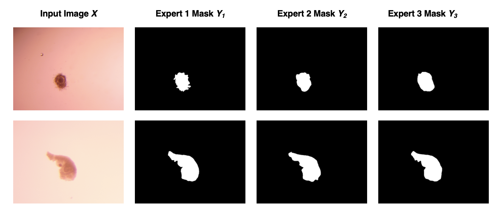
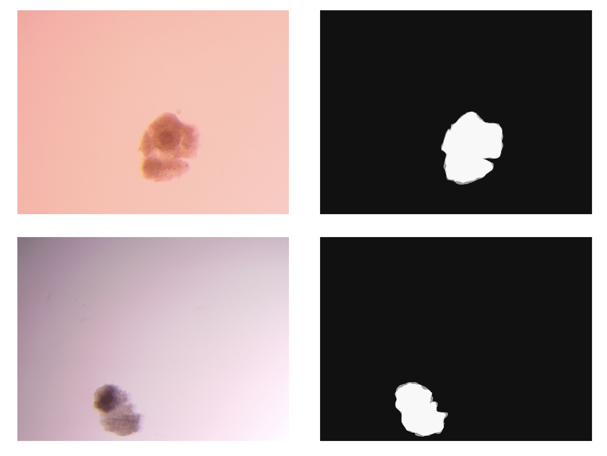
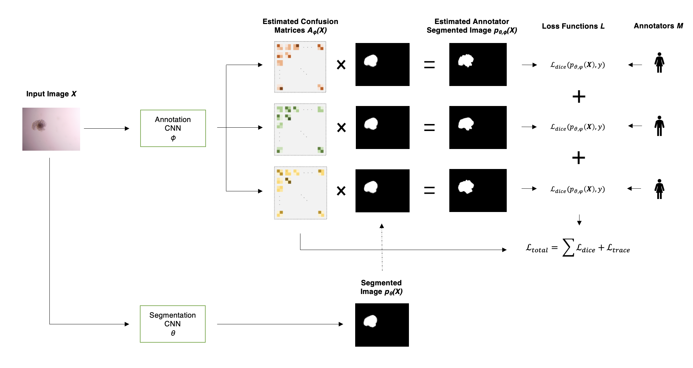
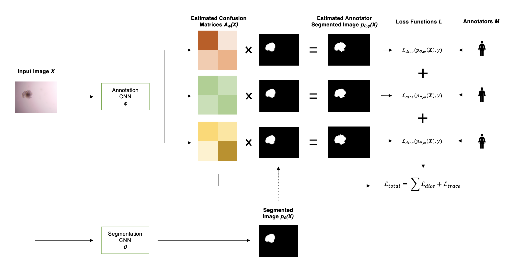
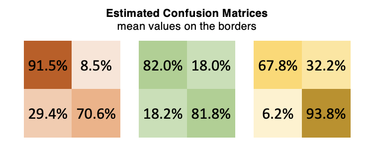
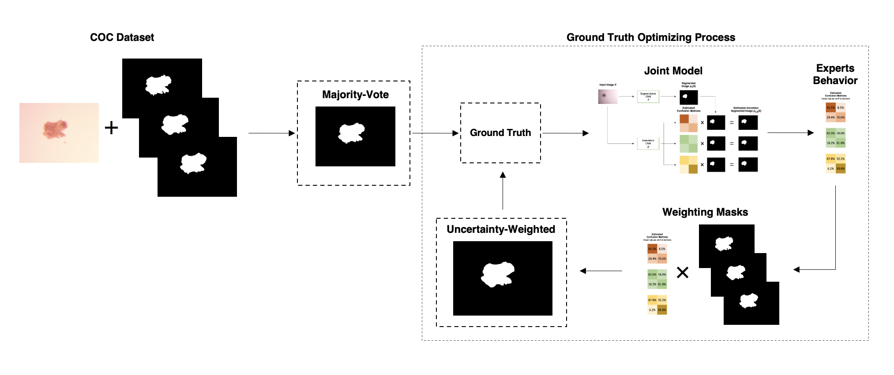

# Maximum Likelihood Ground Truth based on Uncertainty Areas

## Overview

We propose a novel method to compute a new ground truth, focusing on areas of high uncertainty among experts.
This approach allows us to better understand the individual characteristics, extract their behavior, and use 
this insight to create a more sophisticated ground truth using maximum-likelihood. 
These findings contribute to the ongoing discussion of leveraging machine learning algorithms for medical image 
segmentation, particularly in scenarios involving multiple human annotators.

## Introduction

The surge of supervised learning methods for segmentation lately has underscored the critical role of label quality in predicting performance. 
This issue is prevalent in the domain of medical imaging, where high annotation costs and inter-observer variability pose significant challenges. 
Acquiring labels commonly involves multiple experts providing their interpretations of the "true" segmentation labels, each influenced by their individual biases. 
The blind acceptance of these noisy labels as the ground truth restricts the potential effectiveness of segmentation algorithms. 
Hereby, we apply coupled convolutional neural network approaches, previously tested on artificial data, to a small-sized real-world dataset of bovine cumulus oocyte complexes for the first time. This dataset is crucial for healthy embryo development. 
The application revealed an important challenge: the inability to effectively learn distinct confusion matrices for each expert due to large areas of agreement.
In response, we propose a novel method that focuses on areas of high uncertainty. 
This approach allows us to understand the individual characteristics better, extract their behavior, and use this insight to create a more sophisticated ground truth using maximum likelihood. 
These findings contribute to the ongoing discussion of leveraging machine learning algorithms for medical image segmentation, particularly in scenarios involving multiple human annotators.

Firstly, this is an insight into a sample of the data for cumulus oocyte complexes.


and the areas of uncertainty in another sample:


### Attempt to disentangle the data from the biased ground truth

The architecture of the model using the proposed local confusion matrices can be found below:


The architecture of the model using the proposed global confusion matrices can be found below:


### Experts behavior

Visualisation of the confusion matrices for each annotator, focusing on the areas of high uncertainty. This representation shows a clear behavior of each expert on the most difficult areas to identify.


### New ground truth on areas on uncertainty using maximum likelihood

The architecture of the model to optimize the ground truth, using the confusion matrices obtained on the uncertain areas and the maximum likelihood theorem:


## Environment Setup

To set up the project environment, follow these steps:

1. Clone the repository:

   ```bash
   git clone <repository-url>

2. Create a new virtual environment:

   ```bash
   python -m venv maximum_likelihood_gt_env

3. Activate the virtual environment (Unix/Linux):

   ```bash
   source maximum_likelihood_gt_env/bin/activate
   
4. Navigate to the project directory:

   ```bash
   cd project-directory
   
5. Install project dependencies:

   ```bash
   pip install -r requirements.txt

## Usage

### Disentangling Model and Confusion Matrices Generation

#### Overview

We recreate the proposed approaches for disentangling the ground truth from human experts' biases...

##### skin learning
```bash
python main.py config/config_skin.json
```

##### coc learning
```bash
python main.py config/config_coc.json
```

##### coc3 learning
```bash
python main.py config/config_coc3.json
```

### Maximum Likelihood Ground Truth based on Uncertainty Areas

#### Overview

We propose a novel method to compute a new ground truth, focusing on areas of high uncertainty among experts...

```bash
python bin/maximum_likelihood_gt.py config/config_mlgt.json
```

## Contributing

Thank you for considering contributing to this project! Contributions are welcome and encouraged. To contribute, please follow these steps:

1. Fork the repository and clone it to your local machine.
2. Create a new branch for your changes:

   ```bash
   git checkout -b feature/your-feature-name
   ```

3. Make your desired changes and ensure that the code passes all tests.
4. Commit your changes:

   ```bash
   git commit -m "Add your commit message"
   ```

5. Push your branch to the remote repository:

   ```bash
   git push origin feature/your-feature-name
   ```

6. Open a pull request on the main repository.
7. Provide a detailed description of your changes and why they are valuable.
8. Collaborate with the maintainers to review and refine your changes.
9. Once your changes are approved, they will be merged into the main branch.


## License

The project is licensed under the ***.

## Contact

For any questions or inquiries, please contact:

- Georgios Athanasiou
  - Email: gathanasiou@iiia.csic.es
  - Project Website: [GitHub Repository](https://github.com/ga83wuw/maximum_likelihood_gt)
  - Issue Tracker: [GitHub Issues](https://github.com/ga83wuw/maximum_likelihood_gt/issues)


   

